- create the watchList :
    - it is a cart so look for the cart built in the book
## My Tasks
- Django Admin Interface: 
  - Via the Django admin interface, a site administrator should be able to view, add, edit, and delete any listings, comments, and bids made on the site.
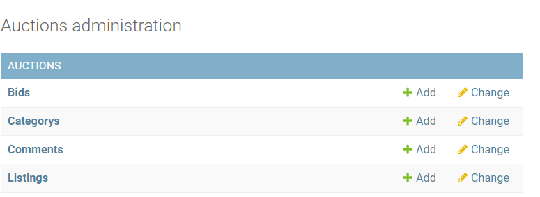
-----
- Models: 
  - Your application should have at least three models in addition to the User model: one for auction listings, one for bids, and one for comments made on auction listings. It’s up to you to decide what fields each model should have, and what the types of those fields should be. You may have additional models if you would like.
  - 
  - ##### my models :
    - Category (name)
    - Listing (owner, title, description, starting_bid, image, category, active, winner, watchers)
    - Bid (owner, listing, price)
    - Comment (author, listing, content, date_created)
----
- Create Listing: 
  - Users should be able to visit a page to create a new listing. They should be able to specify a title for the listing, a text-based description, and what the starting bid should be. Users should also optionally be able to provide a URL for an image for the listing and/or a category (e.g. Fashion, Toys, Electronics, Home, etc.).
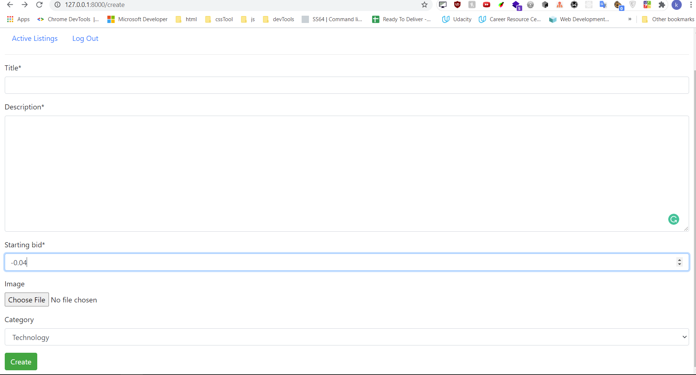

---
- Active Listings Page: 
  - The default route of your web application should let users view all the currently active auction listings. For each active listing, this page should display (at minimum) the title, description, current price, and photo (if one exists for the listing).
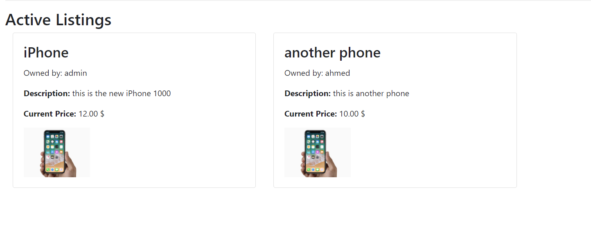
    
---
- Listing Page: 
  - Clicking on a listing should take users to a page specific to that listing. On that page, users should be able to view all details about the listing, including the current price for the listing.
  -
  - if a user is signed in on a closed listing page, and the user has won that auction, the page should say so.
   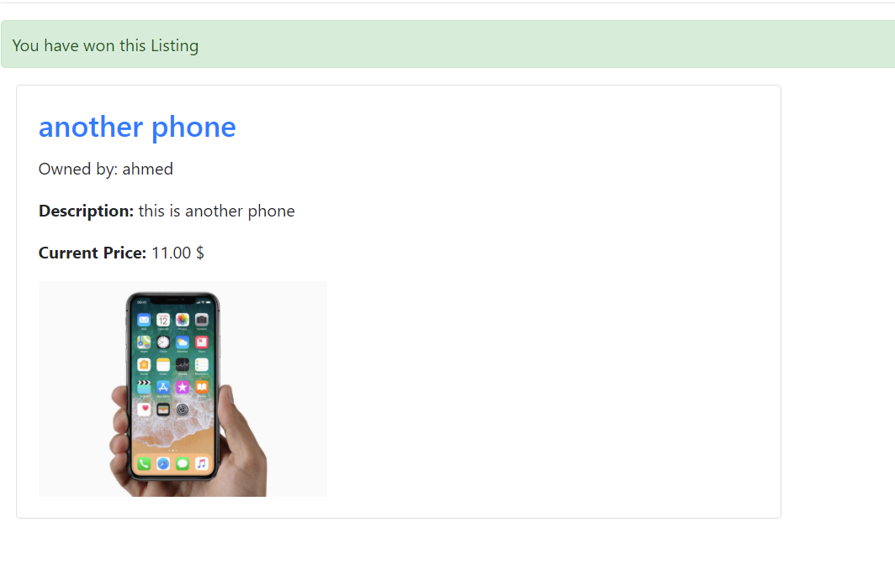
  - 
  - Users who are signed in should be able to add comments to the listing page. The listing page should display all comments that have been made on the listing.
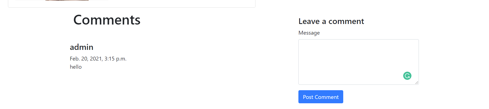
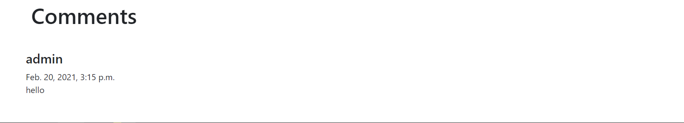
    - If the user is signed in and is the one who created the listing, the user should have the ability to “close” the auction from this page, which makes the highest bidder the winner of the auction and makes the listing no longer active
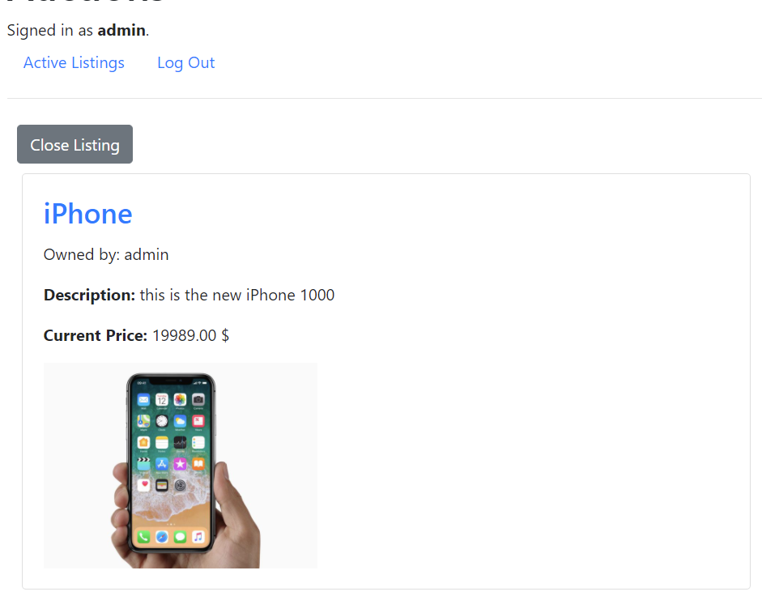
    - 
    - If the user is signed in, the user should be able to bid on the item. The bid must be at least as large as the starting bid, and must be greater than any other bids that have been placed (if any). If the bid doesn’t meet those criteria, the user should be presented with an error.
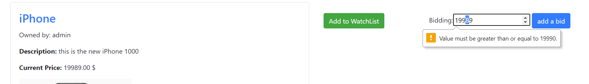
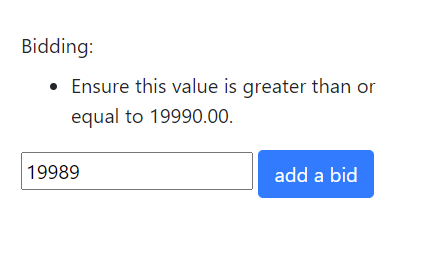
    -
    - If the user is signed in, the user should be able to add the item to their “Watchlist.” If the item is already on the watchlist, the user should be able to remove it.
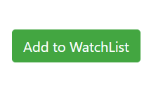
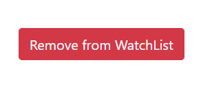